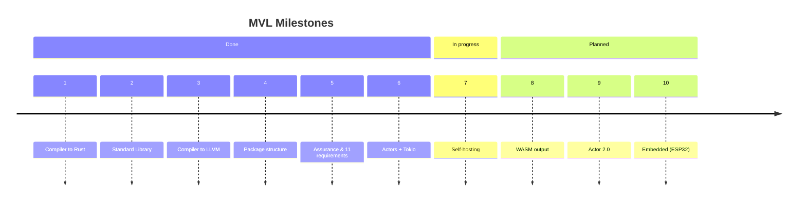

# Roadmap

MVL is built in ten milestones. Each one delivers a distinct capability that the previous could not have. Milestones 1–6 are complete and shipped. Milestone 7 is in progress.

---

## Milestones

---

## ✅ 1 — Compiler to Rust

The MVL compiler translates MVL source to Rust and invokes `rustc`. This gives MVL programs access to the full Rust ecosystem from day one, and lets Rust handle requirements 1–6 (memory safety, type safety, ownership) natively.

The Rust backend remains the default and production-ready path. All eleven requirements are enforced at the MVL checker layer, before emit. The emitted Rust carries no verification overhead.

---

## ✅ 2 — Standard Library

A pure-MVL standard library covering the full range of systems programming needs: I/O, networking, JSON, logging, configuration, environment, time, crypto, process management, property-based testing, structured audit trails, and more.

Every stdlib function that can fail returns `Result`. Every function with side effects declares them. Every function receiving external data labels it `Tainted`. The stdlib is itself verified by `mvl check` — it is a customer of the language it ships with.

**Key modules:** `std.io`, `std.net`, `std.log`, `std.audit`, `std.json`, `std.config`, `std.args`, `std.time`, `std.crypto`, `std.pbt`, `std.actors`, `std.runtime`

---

## ✅ 3 — Compiler to LLVM

A second backend that emits LLVM IR directly, removing `rustc` from the trust chain. This is the CompCert principle applied: one compiler, one proof chain. Two compilers that agree on output is not the same as one compiler that is proven correct.

The LLVM backend runs alongside the Rust backend. Both must produce semantically equivalent output — cross-backend parity tests (`make test-cross-backend`) enforce this continuously.

---

## ✅ 4 — Package Structure

A package system for distributing verified MVL libraries. Packages declare their dependencies, native bindings, and license in `mvl.toml`. The lock file pins every dependency to an exact version and SHA-256 hash. `mvl install` verifies the hash before unpacking.

Every package's public API satisfies all eleven requirements. Packages may use `extern` blocks in their `internal/` directory; every extern boundary requires a written rationale in the manifest.

**Tooling:** `mvl install`, `mvl audit`, `mvl sbom`, SBOM generation (CycloneDX and SPDX), license policy enforcement.

---

## ✅ 5 — Assurance and the 11 Requirements

The full eleven-requirement verification pipeline is in place and tested. The `mvl assurance` command produces a machine-readable proof record for every source file: which requirements are proven, which refinements were discharged at which solver layer, and a complete IFC audit trail of every label transition.

This is the compliance artefact for safety-critical certification (DO-178C, IEC 61508, ISO 26262, SOC 2). The assurance report is generated by the same compiler invocation that produces the binary — the proof record and the artifact cannot diverge.

**Tooling:** `mvl assurance`, `mvl prove`, `mvl check`, `mvl sbom`, `mvl audit`

---

## ✅ 6 — Erlang-Inspired Actors + Tokio

An actor model for safe concurrency, inspired by Erlang's process model and backed by Tokio. Mutable state lives inside actor fields and is only accessible via message sends — no shared memory, no data races (Requirement 9).

Actor behaviors (`pub fn`) are async. The compiler enforces sendability: parameters must be value types, `val`-borrowed, or `iso`-isolated. The supervision model (`std.actors`) supports bidirectional links and one-way monitors for fault-tolerant trees.

The runtime maps actors onto Tokio tasks. Actor communication is type-safe — the compiler knows every message type at compile time.

---

## 🔄 7 — Self-Hosting

The MVL compiler, rewritten in MVL. The compiler verifies its own source — MVL becomes its own first customer of all eleven requirements.

**Current progress:**

| Phase | Scope | Status |
|-------|-------|--------|
| 1 | Shared types (`compiler/tir.mvl`) | ✅ Done |
| 3 | Lexer + recursive descent parser | ✅ Done |
| A | MVL-hosted LLVM and Rust emitters | ✅ Done |
| 2 | Resolver, monomorphizer, TIR lowering | 🔄 In progress |
| 4 | Type checker + 11-requirement passes + solver | 🔄 In progress |
| 6 | Three-stage bootstrap verify | ⬜ Planned |

When complete, the bootstrap will run three stages: the Rust compiler produces `mvl₁`, `mvl₁` compiles the MVL source to produce `mvl₂`, and `mvl₁ == mvl₂` byte-for-byte. Divergence indicates a bug in the self-hosted compiler.

See [Bootstrapping](../docs/bootstrapping.md) for the full build instructions.

---

## ⬜ 8 — WASM Output

A WebAssembly backend, enabling MVL programs to run in browsers, edge runtimes (Cloudflare Workers, Fastly Compute), and embedded WASM hosts (wasmtime, wasmer).

The eleven requirements hold in the WASM target. Effect tracking (`! Net`, `! FileRead`) maps to WASI capabilities. IFC labels enforce that secret values never reach the WASM host interface without explicit declassification.

This milestone also enables MVL as a policy language: compile a policy module to WASM and embed it in any host that can run a WASM sandbox.

---

## ⬜ 9 — Actor 2.0

An extended actor model addressing the limitations of the current design. Key open items (tracked in GitHub issues):

- **Async behaviors** — `pub fn` behaviors that can `await` futures and yield within a turn, not just send-and-return
- **Typed mailboxes** — explicit protocol types on actor interfaces (building on the session type groundwork already in the grammar)
- **Selective receive** — pattern-match on the mailbox without draining it; essential for timeout and priority handling
- **Distributed actors** — location-transparent actor references across nodes; the effect system tracks `! Net` for cross-node sends
- **Back-pressure** — bounded mailboxes with `! Block` or `! Drop` overflow policies, declared in the actor signature
- **Hot code upgrade** — actor state migration between versions without restart

The foundation (Requirement 9, `std.actors`, Tokio runtime) is already in place. Actor 2.0 builds the protocol-level and distributed-systems layer on top.

---

## ⬜ 10 — Embedded Variant: Rust + ESP32

A `no_std` profile targeting embedded systems — specifically the ESP32 family (Xtensa and RISC-V cores). The compiler emits bare-metal Rust or LLVM IR with no heap allocator, no OS, and no runtime beyond what fits in flash.

The eleven requirements hold in the embedded target. Ownership and linearity eliminate heap fragmentation and double-free. Effect tracking maps to hardware peripherals (`! GPIO`, `! SPI`, `! UART`). Refinement types enforce hardware register bounds at compile time.

The embedded profile strips the stdlib to a `no_std` core (arithmetic, basic collections on the stack, IFC labels) and provides a hardware abstraction layer (`std.hal`) for GPIO, I2C, SPI, UART, and timers.

This milestone delivers MVL as a safety-qualified language for microcontroller firmware — a path from MVL's eleven requirements to IEC 61508 SIL 2/3 certification for embedded software.

---

## Principles Behind the Roadmap

Each milestone delivers a capability that is independently useful and does not require the next one to be complete. You can write production MVL programs today (milestones 1–6). Self-hosting is operational as a verification pass today (you can already run `mvl check compiler/`). WASM and embedded are independent targets that do not block each other.

The ordering follows a simple rule: **foundations before applications**. Get the verification model right (1–5), then concurrency (6), then the compiler verifies itself (7), then expand the target surface (8–10).

The language syntax and the eleven requirements are stable. New milestones extend what MVL can target and how deeply it can verify, without changing what valid MVL programs look like.
