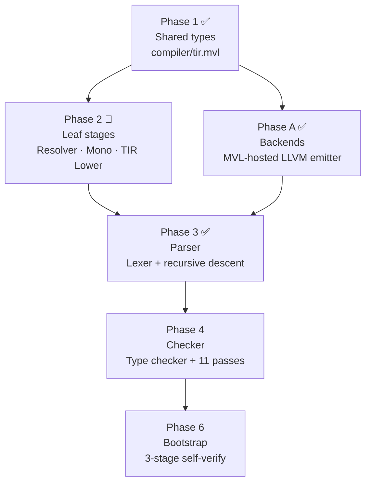

# Bootstrapping MVL

MVL has two compilers that live in the same repository:

| Compiler | Language | Location | Role |
|----------|----------|----------|------|
| **Bootstrap** | Rust | `src/` | Stage 0 — compiles MVL from scratch |
| **Self-hosted** | MVL | `compiler/` | Compiles itself once the bootstrap is ready |

This page walks through building both, from a fresh machine to a working self-hosted binary.

---

## Prerequisites

### Rust

The bootstrap compiler is written in Rust. Install the stable toolchain via [rustup](https://rustup.rs/):

```bash
curl --proto '=https' --tlsv1.2 -sSf https://sh.rustup.rs | sh
source $HOME/.cargo/env
```

Verify:

```bash
rustc --version   # rustc 1.86 or newer
cargo --version
```

??? tip "Optional: Z3 for Layer 5 proofs"
    The refinement solver's Layer 5 uses Z3 for the deepest proofs. It is a Cargo feature — the build works without it.

    macOS:
    ```bash
    brew install z3
    ```
    Linux (Debian/Ubuntu):
    ```bash
    apt install libz3-dev
    ```
    Without Z3, Layers 1–4 still run (trivial, interval, symbolic, Cooper arithmetic). Only the SMT fallback is disabled.

---

## Stage 0 — Build the Bootstrap Compiler

Clone the repository and build with Cargo:

```bash
git clone https://github.com/mvl-lang/mvl.git
cd mvl
cargo build --release
```

The binary lands at `target/release/mvl`. Add it to your PATH:

```bash
export PATH="$PWD/target/release:$PATH"
mvl --version
# mvl 0.240.0
```

Or use the Makefile shorthand:

```bash
make build          # debug build  → target/debug/mvl
make build-release  # release build → target/release/mvl
```

!!! note "Debug vs release"
    `cargo build` (debug) is faster to compile and includes extra assertions. `cargo build --release` optimises the binary — use this for everyday `mvl` usage.

---

## Stage 1 — Verify the Self-Hosted Compiler

The self-hosted compiler lives in `compiler/`. Use the Stage 0 binary to check it:

```bash
mvl check compiler/
```

Expected output (scores reflect current proof coverage — not yet 11/11 everywhere):

```
compiler/backends/llvm/emit_context.mvl: OK  (9/11 requirements proven)
compiler/backends/llvm/emit_exprs.mvl:   OK  (9/11 requirements proven)
compiler/backends/llvm/emit_helpers.mvl: OK  (9/11 requirements proven)
compiler/backends/llvm/emit_match.mvl:   OK  (9/11 requirements proven)
compiler/backends/llvm/emit_program.mvl: OK  (9/11 requirements proven)
compiler/backends/llvm/emit_stmts.mvl:   OK  (9/11 requirements proven)
compiler/backends/llvm/emit_types.mvl:   OK  (9/11 requirements proven)
compiler/backends/llvm/emitter.mvl:      OK  (9/11 requirements proven)
compiler/context.mvl:                    OK  (9/11 requirements proven)
compiler/effects.mvl:                    OK  (9/11 requirements proven)
compiler/lexer.mvl:                      OK  (9/11 requirements proven)
compiler/main.mvl:                       OK  (10/11 requirements proven)
compiler/mono.mvl:                       OK  (9/11 requirements proven)
compiler/parser.mvl:                     OK  (9/11 requirements proven)
compiler/resolver.mvl:                   OK  (9/11 requirements proven)
compiler/tir.mvl:                        OK  (8/11 requirements proven)
compiler/tir_lower.mvl:                  OK  (9/11 requirements proven)
compiler/verify_errors.mvl:              OK  (8/11 requirements proven)
compiler/verify_passes.mvl:              OK  (9/11 requirements proven)
compiler/verify_types.mvl:               OK  (9/11 requirements proven)
```

To see the full assurance report:

```bash
mvl assurance compiler/ --verbose
```

To run the MVL-in-MVL test suite:

```bash
make test-mvl
```

To run the self-hosted lex+parse pipeline over the full corpus (bootstrap smoke test):

```bash
make test-bootstrap
```

This feeds every `tests/corpus/` file through `compiler/main.mvl` and fails if any produce parse errors.

---

## Stage 2 — Build the Self-Hosted Compiler

!!! warning "Not yet available"
    `mvl build compiler/main.mvl` currently fails with Rust compilation errors in the
    MVL compiler's own source (`src/tir.rs`), unrelated to the self-hosted code.

    The LLVM emitter itself (`compiler/backends/llvm/`) is fully implemented and usable
    today via the TIR pipeline:

    ```bash
    mvl tir foo.mvl | mvl run compiler/backends/llvm/emitter.mvl > foo.ll
    ```

    Full `mvl build` support for the self-hosted frontend is tracked in the phase table below.

---

## Bootstrap Phases

The full self-hosting plan is split into six phases ([ADR-0044](https://github.com/mvl-lang/mvl/blob/main/.openspec/adr/0044-self-hosting-tir-first-strategy.md)):



### Current status

| Phase | Scope | Status |
|-------|-------|--------|
| 1 | Shared types (`compiler/tir.mvl`) | ✅ Done |
| 3 | Parser — Lexer + recursive descent | ✅ Done |
| A | MVL-hosted LLVM emitter (`compiler/backends/llvm/`) | ✅ Done |
| 2 | Leaf stages — Resolver, Mono, TIR Lower | 🔄 In progress |
| 4 | Checker — type checker + 11 requirement passes | ⬜ Planned |
| 6 | Three-stage bootstrap verify | ⬜ Planned |

### Three-stage verification (Phase 6)

When Phase 6 completes, the build will perform a full [trusting trust](https://dl.acm.org/doi/10.1145/358198.358210) check:

```
Stage 0:  Rust bootstrap   →  mvl₀  (trusted base)
Stage 1:  mvl₀  compiles compiler/  →  mvl₁
Stage 2:  mvl₁  compiles compiler/  →  mvl₂

assert mvl₁ == mvl₂   # byte-identical output ← bootstrap proven
```

A divergence between Stage 1 and Stage 2 would indicate a bug in the self-hosted compiler that the bootstrap masked. Byte identity gives confidence that the two compilers are semantically equivalent.

---

## Quick Reference

```bash
# One-time setup
curl --proto '=https' --tlsv1.2 -sSf https://sh.rustup.rs | sh
git clone https://github.com/mvl-lang/mvl.git && cd mvl

# Stage 0: build the bootstrap compiler
cargo build --release
export PATH="$PWD/target/release:$PATH"

# Stage 1: verify the self-hosted source
mvl check compiler/
mvl assurance compiler/ --verbose
make test-mvl
make test-bootstrap   # lex+parse corpus through the self-hosted frontend
```

---

## See Also

- [Install MVL](../install.md) — pre-built binaries and quick install
- [Build Assurance](../why/build-assurance.md) — what the assurance report contains
- [The 11 Requirements](../why/requirements.md) — what the compiler proves about itself
